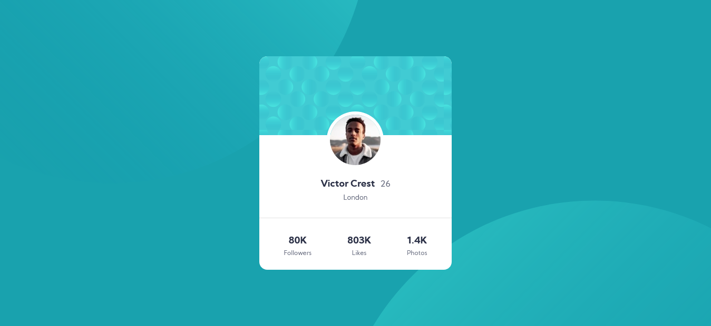
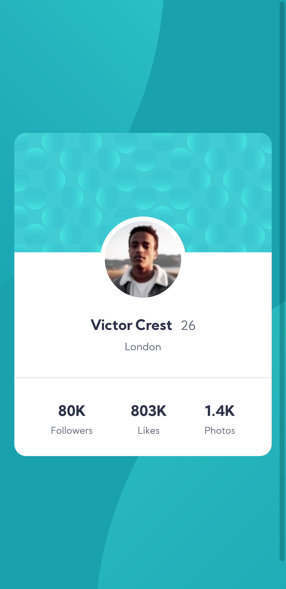

# Frontend Mentor - Profile card component solution

## Table of contents

- [Overview](#overview)
  - [The challenge](#the-challenge)
  - [Screenshot](#screenshot)
  - [Links](#links)
- [My process](#my-process)
  - [Built with](#built-with)
  - [What I learned](#what-i-learned)
- [Author](#author)


## Overview


This is a solution to the [Profile card component challenge on Frontend Mentor](https://www.frontendmentor.io/challenges/profile-card-component-cfArpWshJ). Frontend Mentor challenges help you improve your coding skills by building realistic projects. 

### The challenge

- Build out the project to the designs provided

### Screenshot




### Links

- Solution URL: [Github](https://github.com/AnnaBai95/profile-card-component-main)
- Live Site URL: [Vercel](https://profile-card-component-main-seven-mu.vercel.app/)

## My process

### Built with

- Semantic HTML5 markup
- CSS custom properties
- Flexbox
- SASS

### What I learned

I learnt how to use multiple backgrounds and style each background.

To see how you can add code snippets, see below:

```css
body {
    background-image: url("../images/bg-pattern-top.svg"), url("../images/bg-pattern-bottom.svg");
    background-repeat: no-repeat, no-repeat;
    background-position: right 649px bottom 287px, left 638px top 381px;
}
```

## Author

- LinkedIn - [Anna Stacia Bailey](https://www.linkedin.com/in/anna-stacia-bailey-123066203/)
- Frontend Mentor - [@AnnaBai95](https://www.frontendmentor.io/profile/AnnaBai95)
